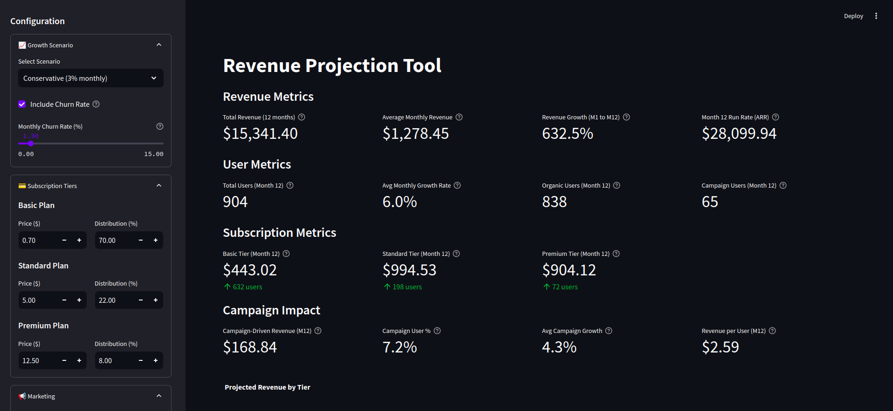
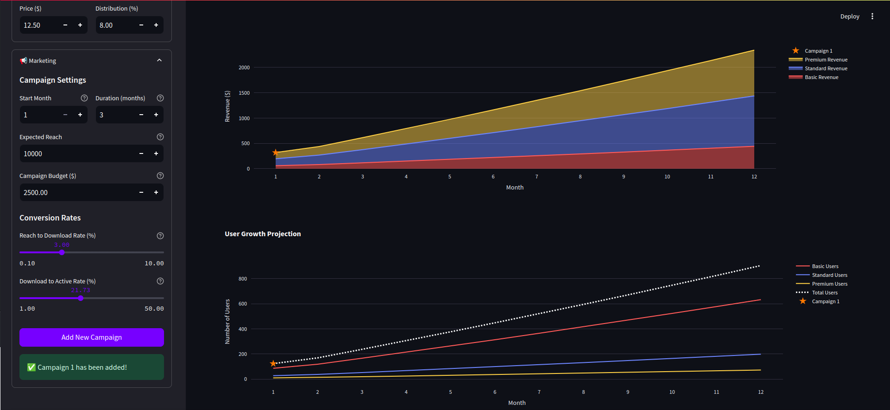

# Revenue Projection Tool

A simple financial modeling and revenue projection tool built with Streamlit. This application helps startups visualize their revenue projections, user growth, and marketing campaign impacts.

## Features

### 💰 Subscription Management
- Multi-tier subscription modeling
- Customizable pricing and features
- Distribution percentage across tiers
- Automatic revenue calculations

### 📈 Growth Scenarios
- Pre-configured growth scenarios:
  - Conservative (3% monthly)
  - Moderate (8% monthly)
  - Aggressive (12% monthly)
- Custom growth rate option (1-200%)
- Churn rate modeling

### 📢 Marketing Campaign System
- Multi-campaign support
- Campaign timing and duration management
- Reach and cost modeling
- Conversion funnel tracking:
  - Reach → Downloads
  - Downloads → Active Users
- Campaign overlap detection
- ROI calculations

### 📊 Visualization
- Interactive revenue charts
- User growth projections
- Campaign impact visualization
- Detailed metrics dashboard
- Monthly projections table
